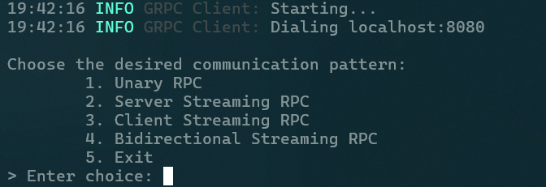
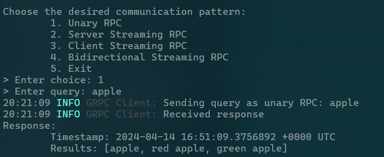
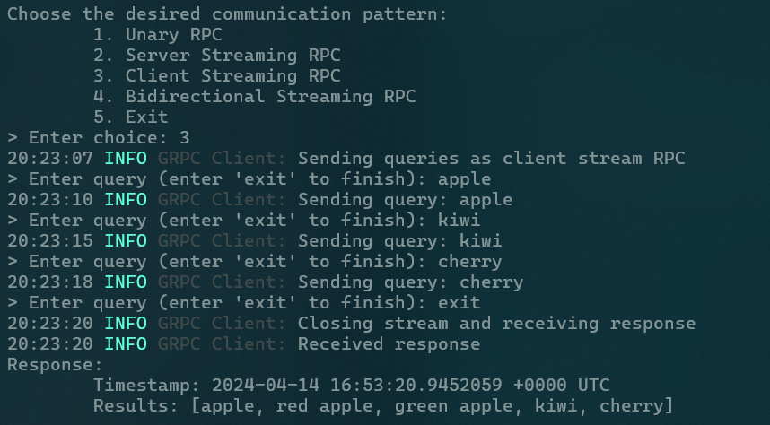
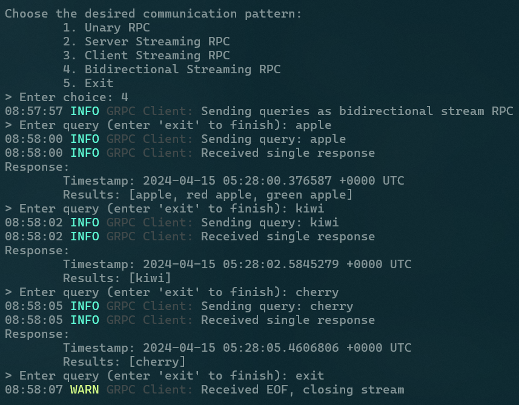

# CA1 - gRPC

- [CA1 - gRPC](#ca1---grpc)
	- [Introduction](#introduction)
	- [Requirements](#requirements)
	- [Description](#description)
		- [Proto](#proto)
			- [Protobuf Messages](#protobuf-messages)
			- [gRPC Services](#grpc-services)
			- [Compilation](#compilation)
		- [Application Structure](#application-structure)
			- [Order Matcher](#order-matcher)
			- [Server](#server)
				- [Command-line Arguments](#command-line-arguments)
				- [Listening \& Serving](#listening--serving)
				- [gRPC](#grpc)
				- [GetOrderUnary](#getorderunary)
				- [GetOrderServerStream](#getorderserverstream)
				- [GetOrderClientStream](#getorderclientstream)
				- [GetOrderBiDiStream](#getorderbidistream)
			- [Client](#client)
				- [Command-line Arguments](#command-line-arguments-1)
				- [Dialing](#dialing)
				- [Menu](#menu)
				- [Unary RPC](#unary-rpc)
				- [Server Streaming RPC](#server-streaming-rpc)
				- [Client Streaming RPC](#client-streaming-rpc)
				- [Bidirectional Streaming RPC](#bidirectional-streaming-rpc)
	- [Comparison of gRPC methods](#comparison-of-grpc-methods)
	- [Task Division](#task-division)

## Introduction

The project is about a simple gRPC server and client that communicate using 4 different communication patterns:

- Unary RPC
- Server Streaming RPC
- Client Streaming RPC
- Bidirectional Streaming RPC

The server contains a list of orders and the client sends a search query to the server. The server then matches the search query with the orders in the database and sends the matched orders back to the client along with the current timestamp.

## Requirements

This project uses `golang` and `protoc` to generate the necessary files for the gRPC server and client. To install the necessary dependencies, run the following commands:

First of all, we need to download and install `golang` which can be found [here](https://go.dev/doc/install).

Then, install `protoc` which can be found [here](https://grpc.io/docs/protoc-installation/).

After installing `protoc`, we need to install the `protoc-gen-go` and `protoc-gen-go-grpc` plugins. To do this, run the following commands:

```bash
go install google.golang.org/protobuf/cmd/protoc-gen-go@latest
go install google.golang.org/grpc/cmd/protoc-gen-go-grpc@latest
```

## Description

### Proto

The `proto` directory contains the `order_management.proto` file which defines the messages and services that will be used by the gRPC server and client.

#### Protobuf Messages

We first need to define the message of the request that the client will send to the server. The message will contain the following fields:

- `query`: The order search string that the client wants to search for

```protobuf
message Request {
  string query = 1;
}
```

Next, we need to define the message of the response that the server will send to the client. The message will contain the following fields:

- `timestamp`: The timestamp of the server reply
- `results`: The list of orders that match the search query

```protobuf
import "google/protobuf/timestamp.proto";

message Response {
  repeated string results = 1;
  google.protobuf.Timestamp timestamp = 2;
}
```

The aforementioned messages are defined in the `order_management.proto` file.

#### gRPC Services

We then need to define the service that the server will provide to the client. The service will contain the following RPCs:

- `GetOrderUnary`: The unary RPC that the client will use to send a single order search query to the server and receive a single response
- `GetOrderServerStream`: The server streaming RPC that the client will use to send a single order search query to the server and receive multiple responses
- `GetOrderClientStream`: The client streaming RPC that the client will use to send multiple order search queries to the server and receive a single response
- `GetOrderBidirectionalStream`: The bidirectional streaming RPC that the client will use to send multiple order search queries to the server and receive multiple responses

```protobuf
service OrderManagement {
  rpc GetOrderUnary(Request) returns (Response) {}
  rpc GetOrderServerStream(Request) returns (stream Response) {}
  rpc GetOrderClientStream(stream Request) returns (Response) {}
  rpc GetOrderBiDiStream(stream Request) returns (stream Response) {}
}
```

The above service is also defined in the `order_management.proto` file.

#### Compilation

The complete `order_management.proto` file is shown below:

```protobuf
syntax = "proto3";

import "google/protobuf/timestamp.proto";

option go_package = "pkg/proto";

message Request {
  string query = 1;
}

message Response {
  repeated string results = 1;
  google.protobuf.Timestamp timestamp = 2;
}

service OrderManagement {
  rpc GetOrderUnary(Request) returns (Response) {}
  rpc GetOrderServerStream(Request) returns (stream Response) {}
  rpc GetOrderClientStream(stream Request) returns (Response) {}
  rpc GetOrderBiDiStream(stream Request) returns (stream Response) {}
}
```

To compile the `order_management.proto` file, run the following command:

```bash
protoc --go_out=. --go-grpc_out=. proto/order_management.proto
```

This will generate the `order_management.pb.go` and `order_management_grpc.pb.go` files in the `pkg/proto` directory.

- `order_management.pb.go`: Contains the generated protobuf messages which are converted to Go structs.
- `order_management_grpc.pb.go`: Contains the generated gRPC services which are converted to Go interfaces.

### Application Structure

The application consists of 3 directories:

- `cmd`: Contains the main executable files for the server and client.
- `pkg`:
  - `matcher`: Contains the order matcher which is used to match the order search query with the orders in the database.
  - `proto`: Contains the generated protobuf messages and gRPC services.
  - `utils`: Contains utility functions that are used by the server and client.
- `proto`: Contains the `order_management.proto` file which defines the messages and services that will be used by the gRPC server and client.

#### Order Matcher

The order matcher contains the order database and a `MatchOrder` function which is used to match the order search query with the orders in the database.  
The order database is a list of orders which are stored as strings.

```go
package matcher

import (
    "strings"
)

var serverOrders = []string{
    "banana",
    "apple",
    "orange",
    "grape",
    "red apple",
    "kiwi",
    "mango",
    "pear",
    "cherry",
    "green apple",
}

func MatchOrder(order string) []string {
    var result []string
    for _, serverOrder := range serverOrders {
        if strings.Contains(serverOrder, order) {
            result = append(result, serverOrder)
        }
    }
    return result
}
```

#### Server

##### Command-line Arguments

The server takes 2 command-line arguments.

- `host`: The host on which the server will listen (default: localhost).
- `port`: The port on which the server will listen (default: 8080).

```go
func main() {
    log.Info("Starting...")

    portPtr := flag.Int("port", defaultPort, "port to listen on")
    hostPtr := flag.String("host", defaultHost, "host to listen on")
    flag.Parse()
    port := *portPtr
    host := *hostPtr

    listenAddr := fmt.Sprintf("%s:%d", host, port)
    // ...
}
```

##### Listening & Serving

The server then starts listening on the specified host and port.  
The server creates a new gRPC server and registers the `OrderManagement` service with the gRPC server.

```go
func main() {
    // ...
    log.Infof("Listening on %s", listenAddr)
    listener, err := net.Listen("tcp", listenAddr)
    if err != nil {
        log.Fatalf("Failed to listen: %v", err)
    }
    grpcServer := grpc.NewServer()
    pb.RegisterOrderManagementServer(grpcServer, &orderManagementServer{})
    if err = grpcServer.Serve(listener); err != nil {
        log.Fatalf("Failed to serve: %v", err)
    }
}
```

##### gRPC

The server imports the generated protobuf messages and gRPC services as `pb`:

```go
import (
    "google.golang.org/grpc"
    "google.golang.org/protobuf/types/known/timestamppb"

    pb "dist-grpc/pkg/proto"
)
```

and defines a new `orderManagementServer` struct which implements the `OrderManagementServer` interface from the generated proto files.

```go
type orderManagementServer struct {
    pb.UnimplementedOrderManagementServer
}
```

The `OrderManagementServer` interface contains the following methods which correspond to the RPCs defined in the `order_management.proto` file:

```go
type OrderManagementServer interface {
    GetOrderUnary(context.Context, *Request) (*Response, error)
    GetOrderServerStream(*Request, OrderManagement_GetOrderServerStreamServer) error
    GetOrderClientStream(OrderManagement_GetOrderClientStreamServer) error
    GetOrderBiDiStream(OrderManagement_GetOrderBiDiStreamServer) error
    mustEmbedUnimplementedOrderManagementServer()
}
```

##### GetOrderUnary

The server implements the `GetOrderUnary` method which is the unary RPC that the client will use to send a single order search query to the server and receive a single response.

```go
func (s *orderManagementServer) GetOrderUnary(ctx context.Context, req *pb.Request) (*pb.Response, error) {
    log.Info("Received unary request", "query", req.GetQuery())
    res := matcher.MatchOrder(req.GetQuery())
    log.Info("Matched orders", "orders", utils.ToString(res))
    log.Info("Sending response", "results", utils.ToString(res))
    return &pb.Response{
        Results:   res,
        Timestamp: timestamppb.Now(),
    }, nil
}
```

The method takes the `Request` message sent by the client and returns a `Response` message.  
The `query` field of the `Request` message is used to search for orders in the order database using the `MatchOrder` function.  
The server then sends the matched orders along with the current timestamp to the client.

##### GetOrderServerStream

The server implements the `GetOrderServerStream` method which is the server streaming RPC that the client will use to send a single order search query to the server and receive multiple responses.

```go
func (s *orderManagementServer) GetOrderServerStream(req *pb.Request, stream pb.OrderManagement_GetOrderServerStreamServer) error {
    log.Info("Received server stream request", "query", req.GetQuery())
    res := matcher.MatchOrder(req.GetQuery())
    log.Info("Matched orders", "orders", utils.ToString(res))
    for _, v := range res {
        resp := pb.Response{
            Results:   []string{v},
            Timestamp: timestamppb.Now(),
        }
        log.Info("Sending single response", "results", v)
        if err := stream.Send(&resp); err != nil {
            return err
        }
    }
    return nil
}
```

The method takes the `Request` message sent by the client and a `stream` which is used to send multiple `Response` messages to the client.  
After searching the order database, the server sends each matched order along with the current timestamp to the client.

##### GetOrderClientStream

The server implements the `GetOrderClientStream` method which is the client streaming RPC that the client will use to send multiple order search queries to the server and receive a single response.

```go
func (s *orderManagementServer) GetOrderClientStream(stream pb.OrderManagement_GetOrderClientStreamServer) error {
    log.Info("Received client stream request")
    var res []string
    for {
        req, err := stream.Recv()
        if err == io.EOF {
            log.Warn("Received EOF, closing stream")
            break
        }
        if err != nil {
            return err
        }
        log.Info("Received request", "query", req.GetQuery())
        list := matcher.MatchOrder(req.GetQuery())
        log.Info("Matched orders", "orders", utils.ToString(list))
        res = append(res, list...)
    }
    result := utils.RemoveDuplicates(res)
    log.Info("Sending response", "results", utils.ToString(result))
    return stream.SendAndClose(&pb.Response{
        Results:   result,
        Timestamp: timestamppb.Now(),
    })
}
```

The method takes a `stream` which is used to receive multiple `Request` messages from the client.  
The server searches the order database for each query and appends the matched orders to a list.  
Receiving an EOF signal from the client indicates that all queries have been received.  
After receiving all the queries, the server removes any duplicates from the list and sends the final list of matched orders along with the current timestamp to the client.

##### GetOrderBiDiStream

The server implements the `GetOrderBiDiStream` method which is the bidirectional streaming RPC that the client will use to send multiple order search queries to the server and receive multiple responses.

```go
func (s *orderManagementServer) GetOrderBiDiStream(stream pb.OrderManagement_GetOrderBiDiStreamServer) error {
    log.Info("Received bidirectional stream request")
    for {
        req, err := stream.Recv()
        if err == io.EOF {
            log.Warn("Received EOF, closing stream")
            return nil
        }
        if err != nil {
            return err
        }
        log.Info("Received request", "query", req.GetQuery())
        res := matcher.MatchOrder(req.GetQuery())
        log.Info("Matched orders", "orders", utils.ToString(res))
        log.Info("Sending response", "results", utils.ToString(res))
        err = stream.Send(&pb.Response{
            Results:   res,
            Timestamp: timestamppb.Now(),
        })
        if err != nil {
            return err
        }
    }
}
```

The method takes a `stream` which is used to receive multiple `Request` messages from the client and send multiple `Response` messages to the client.  
The same stream object is used to both receive and send messages.  
Queries are received from the client and matched orders are sent back to the client along with the current timestamp. This is done until the client sends an EOF signal.

#### Client

##### Command-line Arguments

The client takes 2 command-line arguments:

- `host`: The host on which the server is listening (default: localhost).
- `port`: The port on which the server is listening (default: 8080).

```go
func main() {
    log.Info("Starting...")

    portPtr := flag.Int("port", defaultPort, "port to listen on")
    hostPtr := flag.String("host", defaultHost, "host to listen on")
    flag.Parse()
    port := *portPtr
    host := *hostPtr

    dialAddr := fmt.Sprintf("%s:%d", host, port)
    // ...
}
```

##### Dialing

The client then dials the server using the specified host and port.  
The client creates a new gRPC connection and creates a new `OrderManagementClient` using the connection.  
The client also defers closing the connection until the end of the program.

```go
func main() {
    // ...
    log.Infof("Dialing %s", dialAddr)

    opts := []grpc.DialOption{grpc.WithTransportCredentials(insecure.NewCredentials())}
    conn, err := grpc.Dial(dialAddr, opts...)
    if err != nil {
        log.Fatalf("Failed to dial: %v", err)
    }
    defer func() {
        err := conn.Close()
        if err != nil {
            log.Fatalf("Failed to close connection: %v", err)
        }
    }()

    client := pb.NewOrderManagementClient(conn)
    // ...
}
```

##### Menu

The client then displays a menu to the user which allows the user to choose one of the 4 desired communication patterns.

```go
func launchMenu(client pb.OrderManagementClient) {
    for {
        fmt.Println()
        fmt.Println("Choose the desired communication pattern:")
        fmt.Println("\t1. Unary RPC")
        fmt.Println("\t2. Server Streaming RPC")
        fmt.Println("\t3. Client Streaming RPC")
        fmt.Println("\t4. Bidirectional Streaming RPC")
        fmt.Println("\t5. Exit")

        fmt.Print("> Enter choice: ")
        var choice int
        scan, err := fmt.Scan(&choice)
        if err != nil || scan != 1 {
            log.Error("Failed to read choice")
            continue
        }

        switch choice {
        case 1:
            unaryRPC(client)
        case 2:
            serverStreamRPC(client)
        case 3:
            clientStreamRPC(client)
        case 4:
            bidirectionalStreamRPC(client)
        case 5:
            return
        default:
            log.Error("Invalid choice")
        }
    }
}
```

The menu looks like this:



##### Unary RPC

First, in the `unaryRPC` function, the user enters a query and sends it to the server using the `GetOrderUnary` method.  
The `getOrderUnary` function first encapsulates the query string into a `Request` message and then sends it to the server to receives a single `Response` message.  
The query is sent using `GetOrderUnary` which is defined in the generated proto `OrderManagementClient` interface.

```go
func getOrderUnary(client pb.OrderManagementClient, query string) {
    log.Infof("Sending query as unary RPC: %s", query)
    ctx, cancel := context.WithCancel(context.Background())
    defer cancel()

    req := pb.Request{Query: query}
    res, err := client.GetOrderUnary(ctx, &req)
    if err != nil {
        log.Fatalf("Failed to get order: %v", err)
    }
    log.Info("Received response")
    printResponse(res)
}

func unaryRPC(client pb.OrderManagementClient) {
    var order string
    fmt.Print("> Enter query: ")
    scan, err := fmt.Scan(&order)
    if err != nil || scan != 1 {
        log.Error("Failed to read query")
        return
    }
    getOrderUnary(client, order)
}
```



##### Server Streaming RPC

In the `serverStreamRPC` function, the user enters a query and sends it to the server using the `GetOrderServerStream` method.  
The `getOrderServerStream` function first encapsulates the query string into a `Request` message and then sends it to the server to receives multiple `Response` messages.  
The query is sent using `GetOrderServerStream` which is defined in the generated proto `OrderManagementClient` interface.  
The response is received using a stream object until it reaches EOF.

```go
func getOrderServerStream(client pb.OrderManagementClient, query string) {
    log.Infof("Sending query as server stream RPC: %s", query)
    ctx, cancel := context.WithCancel(context.Background())
    defer cancel()

    req := pb.Request{Query: query}
    stream, err := client.GetOrderServerStream(ctx, &req)
    if err != nil {
        log.Fatalf("Failed to get order: %v", err)
        return
    }

    for {
        resp, err := stream.Recv()
        if err == io.EOF {
            log.Warn("Received EOF, closing stream")
            break
        }
        if err != nil {
            log.Fatalf("Failed to receive response: %v", err)
        }
        log.Info("Received single response")
        printResponse(resp)
    }
}

func serverStreamRPC(client pb.OrderManagementClient) {
    var order string
    fmt.Print("> Enter query: ")
    scan, err := fmt.Scan(&order)
    if err != nil || scan != 1 {
        log.Error("Failed to read query")
        return
    }
    getOrderServerStream(client, order)
}
```


##### Client Streaming RPC

In the `clientStreamRPC` function, the user enters multiple queries and simultaneously sends them to the server using the `GetOrderClientStream` method.  
The `getOrderClientStream` function receives the queries from a channel and sends them to the server to receive a single `Response` message.  
The `clientStreamRPC` function creates a goroutine channel which read the user inputs and sends them to a channel which is used by the `getOrderClientStream` function.
This means that the user is entering and sending queries at the same time but the response is received only after all the queries have been sent.

```go
func getOrderClientStream(client pb.OrderManagementClient, queryChan chan string) {
    log.Info("Sending queries as client stream RPC")
    ctx, cancel := context.WithCancel(context.Background())
    defer cancel()

    stream, err := client.GetOrderClientStream(ctx)
    if err != nil {
        log.Fatalf("Failed to get order: %v", err)
        return
    }

    for query := range queryChan {
        log.Infof("Sending query: %s", query)
        if err := stream.Send(&pb.Request{Query: query}); err != nil {
            log.Fatalf("Failed to send request: %v", err)
        }
    }

    log.Info("Closing stream and receiving response")
    resp, err := stream.CloseAndRecv()
    if err != nil {
        log.Fatalf("Failed to receive response: %v", err)
    }
    log.Info("Received response")
    printResponse(resp)
}

func clientStreamRPC(client pb.OrderManagementClient) {
    queryChan := make(chan string)
    go func() {
        for {
            time.Sleep(500 * time.Millisecond)
            var order string
            fmt.Print("> Enter query (enter 'exit' to finish): ")
            scan, err := fmt.Scan(&order)
            if err != nil || scan != 1 {
                log.Error("Failed to read query")
                return
            }
            if order == "exit" {
                break
            }
            queryChan <- order
        }
        close(queryChan)
    }()
    getOrderClientStream(client, queryChan)
}
```



##### Bidirectional Streaming RPC

In the `bidirectionalStreamRPC` function, the user enters multiple queries and sends them to the server using the `GetOrderBiDiStream` method.  
The `getOrderBiDiStream` function receives the queries from a channel and sends them to the server to receive multiple `Response` messages.  
The `bidirectionalStreamRPC` function creates a goroutine channel which read the user inputs and sends them to a channel which is used by the `getOrderBiDiStream` function.
This means that the user is entering and sending queries at the same time and the response is received as soon as the server sends it.  
The server sends multiple responses to the client until it receives an EOF signal.

```go
func GetOrderBiDiStream(client pb.OrderManagementClient, queryChan chan string) {
    log.Info("Sending queries as bidirectional stream RPC")
    ctx, cancel := context.WithCancel(context.Background())
    defer cancel()

    stream, err := client.GetOrderBiDiStream(ctx)
    if err != nil {
        log.Fatalf("Failed to get order: %v", err)
        return
    }

    waitc := make(chan struct{})
    go func() {
        for {
            resp, err := stream.Recv()
            if err == io.EOF {
                log.Warn("Received EOF, closing stream")
                close(waitc)
                return
            }
            if err != nil {
                log.Fatalf("Failed to receive response: %v", err)
            }
            log.Info("Received single response")
            printResponse(resp)
        }
    }()

    for query := range queryChan {
        log.Printf("Sending query: %s", query)
        if err := stream.Send(&pb.Request{Query: query}); err != nil {
            log.Fatalf("Failed to send request: %v", err)
        }
    }
    err = stream.CloseSend()
    if err != nil {
        log.Fatalf("Failed to close send: %v", err)
    }
    <-waitc
}

func bidirectionalStreamRPC(client pb.OrderManagementClient) {
    queryChan := make(chan string)
    go func() {
        for {
            time.Sleep(500 * time.Millisecond)
            var order string
            fmt.Print("> Enter query (enter 'exit' to finish): ")
            scan, err := fmt.Scan(&order)
            if err != nil || scan != 1 {
                log.Error("Failed to read query")
                return
            }
            if order == "exit" {
                break
            }
            queryChan <- order
        }
        close(queryChan)
    }()
    GetOrderBiDiStream(client, queryChan)
}
```



## Comparison of gRPC methods

The 4 gRPC communication patterns are compared below:

- Unary RPC
  - The client sends a single request to the server and receives a single response.
  - The client waits for the server to process the request and send a response.
  - The client can send multiple requests but each request is processed sequentially.
- Server Streaming RPC
  - The client sends a single request to the server and receives multiple responses.
  - The client waits for the server to process the request and send multiple responses.
  - The client can send multiple requests but each request is processed sequentially.
- Client Streaming RPC
  - The client sends multiple requests to the server and receives a single response.
  - The client can send multiple requests concurrently.
  - The server waits for all the requests to be received before processing them and sending a response.
- Bidirectional Streaming RPC
  - The client sends multiple requests to the server and receives multiple responses.
  - The client can send multiple requests concurrently.
  - The server processes each request as it is received and sends a response.

The choice of communication pattern depends on the requirements of the application.

- Unary RPC is suitable for simple request-response interactions.
- Server Streaming RPC is suitable for scenarios where the server needs to send multiple responses to a single request.
- Client Streaming RPC is suitable for scenarios where the client needs to send multiple requests to the server and receive a single response.
- Bidirectional Streaming RPC is suitable for scenarios where the client and server need to send multiple requests and responses concurrently.

## Task Division

We implemented all the 4 methods of gRPC communication patterns to further understand how gRPC works.
